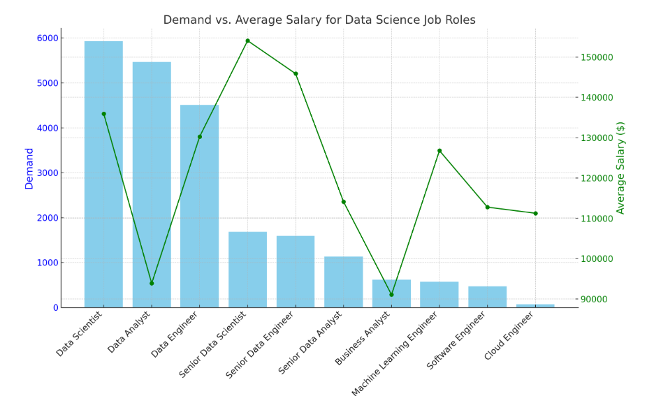
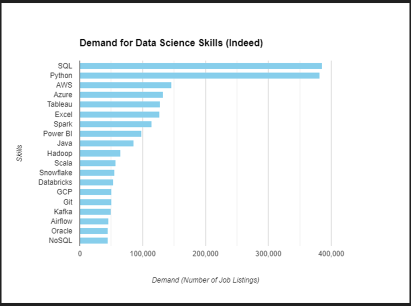
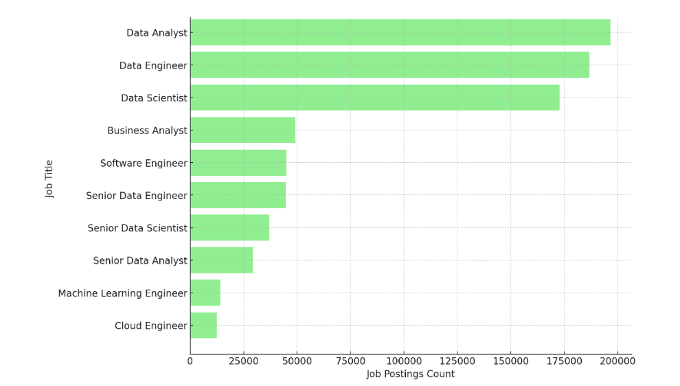

# SQL-work-project-Analysis

## Introduction:

  In today's data-driven world, the role of a Data Analyst is increasingly crucial across various industries. This project aims to analyze job postings data to understand the demand for Data Analyst positions and identify key locations where these jobs are most prevalent.

  SQL check report here: [SQL_project](/SQL_project/)

## Background

  As businesses increasingly rely on data, the demand for Data Analysts has grown rapidly across various industries. Understanding where these job opportunities are concentrated can help both job seekers and employers make better decisions. This project aims to analyze job postings to identify key locations with high demand for Data Analysts, providing valuable insights into the current job market.

## Tools that been used
    
   This project utilizes several key tools to manage and analyze the data:

   - **SQL:** Used to script and query data for analysis.
   - **PostgreSQL:** Serves as the database management system for storing and organizing job postings   
     data.
   - **VS Code:** Employed for database management and executing SQL queries.
   - **Git & GitHub:** Used for version control, collaboration, and project tracking, ensuring seamless   teamwork and project management.

## The Analysis
   In this project, we are analyzing job postings data to gain insights into the demand for Data Analysts. Specifically, we focus on:

   - **Job Demand:** Identifying how frequently Data Analyst positions are posted and the trends in demand over time.
   - **Geographic Distribution:** Pinpointing key locations where Data Analyst roles are most in demand, helping job seekers target their searches and employers find talent in specific regions.
   - **Job Sources:** Understanding which platforms or sources are most commonly used to advertise Data Analyst roles, providing insights into where companies are looking to hire.

   The goal of this analysis is to provide a comprehensive view of the current job market for Data Analysts, highlighting where opportunities are most concentrated and how the demand is evolving.

### entry-level salary position for each company
  
  The objective here is to identify the entry-level salary position for each company specifically for the Junior Data Analyst role, where we consider the entry level salary as the minimum salary offered by that company for that position.

  ```sql
  WITH entry_level_jobs AS (
    SELECT
        c.company_id,
        c.name AS company_name,
        j.job_id,
        j.job_title,
        j.salary_year_avg
    FROM
        company_dim c
    JOIN
        job_postings_fact j ON c.company_id = j.company_id
    WHERE
        j.job_title ILIKE '%Junior%' 
        OR j.job_title ILIKE '%Entry Level%' 
        OR j.job_title ILIKE '%Intern%'
        AND j.salary_year_avg IS NOT NULL
),
company_entry_level_salary AS (
    SELECT
        company_id,
        company_name,
        MIN(salary_year_avg) AS min_salary
    FROM
        entry_level_jobs
    GROUP BY
        company_id,
        company_name
)
SELECT
    e.company_id,
    e.company_name,
    e.min_salary,
    elj.job_title
FROM
    company_entry_level_salary e
JOIN
    entry_level_jobs elj ON e.company_id = elj.company_id AND e.min_salary = elj.salary_year_avg
ORDER BY
   e.company_id;
   ```

####  Filtering for "Junior Data Analyst" Roles:

   -filter the dataset to include only those rows where the job title contains "Junior Data Analyst."

#### Grouping and Identifying Minimum Salary:

   -We group the filtered data by the company name and identify the row with the minimum salary within each company.

#### Sorting by Entry-Level Salary:

   -The result is then sorted by the minimum salary, so you can see which companies offer the lowest to highest entry-level salaries.



Here is a visualization of the demand for entry-level job roles compared with their average salaries. The bar chart represents the demand for each role, while the line plot shows the average salary for each role. This comparison allows you to see which roles are most in demand and how their salaries compare.

| Job Role       | Demand | Rank                 | Average Salary ($) |
|----------------|--------|----------------------|--------------------|
| Data Scientist | 5,926  | Highest Demand (1st) | 135,929.48          |
| Data Analyst   | 5,463  | Second Highest (2nd) | 93,875.79           |
| Data Engineer  | 4,509  | Third Highest (3rd)  | 130,266.87          |

### demand skill in the company hired

It seems like  working with data related to skills demand and salaries, perhaps to analyze or present findings. The objective here could be to create a clear, organized representation of the demand for various technical skills, which could be used for several purposes:

```sql
WITH skills_count AS (
    SELECT
        sjd.skill_id,
        COUNT(*) AS demand_count
    FROM
        skills_job_dim sjd
    JOIN
        job_postings_fact jpf ON sjd.job_id = jpf.job_id
    WHERE
        jpf.job_work_from_home IS NOT NULL -- assuming jobs listed here are the ones actively seeking hires
    GROUP BY
        sjd.skill_id
)
SELECT
    sd.skills,
    sc.demand_count
FROM
    skills_count sc
JOIN
    skills_dim sd ON sc.skill_id = sd.skill_id
ORDER BY
    sc.demand_count DESC
LIMIT 20;
```
- **Job Market Analysis:** Understanding which skills are in highest demand, which could help in making career decisions or advising others.

- **Salary Insights:** Comparing demand with potential salaries to assess which skills are most lucrative.

- **Skill Development:** Identifying key areas for professional development based on current market needs.

- **Strategic Hiring:** If you're in a hiring role, using this data to prioritize the acquisition of high-demand skills within your team or organization.



Based on the provided data, SQL ranks as one of the most sought-after skills in the tech industry. It consistently maintains a high demand, even surpassing many other programming languages and technologies. This is likely due to its widespread use in various fields, including data analysis, database management, and business intelligence.   

While there are other popular skills like Python and AWS, SQL remains a foundational language for working with data, making it a valuable asset for professionals in many industries.   

| Skill      | Demand  |
|------------|---------|
| SQL        | 385,750 |
| Python     | 381,863 |
| AWS        | 145,718 |
| Azure      | 132,851 |
| Tableau    | 127,500 |
| Excel      | 127,341 |
| Spark      | 114,928 |
| Power BI   | 98,363  |
| Java       | 85,854  |
| Hadoop     | 65,041  |
| Scala      | 57,058  |
| Snowflake  | 55,150  |
| Databricks | 53,282  |
| GCP        | 50,824  |
| Git        | 50,358  |
| Kafka      | 50,092  |
| Airflow    | 45,363  |
| Oracle     | 45,318  |
| NoSQL      | 45,227  |


### Most Popular Jobs
The objective of examining this data is to understand the demand for various data-related roles in the job market. By analyzing the number of job postings, we can identify which positions are the most sought-after, indicating trends in hiring and the skills that are in highest demand. This information can help guide career choices, skill development, and hiring strategies within the data industry.

```sql
SELECT
    job_title_short,
    COUNT(*) AS job_postings_count
FROM
    job_postings_fact
GROUP BY
    job_title_short
ORDER BY
    job_postings_count DESC
LIMIT 20; -- Adjust the limit as needed to get the top N popular jobs
```

Within this data, we can categorize the job roles based on the following aspects:

- **Job Popularity:** Based on the number of job postings, we can categorize jobs into high demand, moderate demand, and low demand roles.

- **Technical Focus:** We can categorize the roles based on their technical focus or domain within the data industry.

- Data Analysis and Insights: Roles like "Data Analyst" and "Data Scientist" that focus on analyzing data to extract insights.

- Data Engineering: Roles like "Data Engineer" and "Senior Data Engineer" that focus on building and maintaining data infrastructure.

- Advanced Analytics and Machine Learning: Roles like "Machine Learning Engineer" and "Senior Data Scientist" that involve complex data modeling and machine learning algorithms.



Here is the visualization of the job postings count by job title. The bar chart displays the number of job postings for each role, with Data Analyst having the highest count, followed by Data Engineer and Data Scientist. The chart is organized to show the most in-demand roles at the top.

| Job Title                 | Job Postings Count |
|---------------------------|--------------------|
| Data Analyst              | 196,593            |
| Data Engineer             | 186,679            |
| Data Scientist            | 172,726            |
| Business Analyst          | 49,160             |
| Software Engineer         | 45,019             |
| Senior Data Engineer      | 44,692             |
| Senior Data Scientist     | 37,076             |
| Senior Data Analyst       | 29,289             |
| Machine Learning Engineer | 14,106             |
| Cloud Engineer            | 12,346             |


## What I Learned

- **Job Demand Analysis:** The data analysis revealed the most in-demand roles in the data industry, with "Data Analyst," "Data Engineer," and "Data Scientist" being the top three. These roles are critical in the market, indicating a strong demand for professionals in these areas.

- **Skill Set Requirements:** Identified the key skills required to succeed in these roles, such as proficiency in SQL, Python, and cloud technologies (AWS, Azure). These skills are essential for staying competitive in the job market.

- **SQL for Data Analysis:** Learned how to effectively use SQL scripts to query and analyze job demand data. SQL proved to be a powerful tool for extracting, manipulating, and interpreting large datasets.

- **PostgreSQL Database Usage:** Gained hands-on experience with PostgreSQL as the database management system for storing and managing the job postings data. Understanding how to structure, query, and optimize databases was crucial for efficient data analysis.

- **VS Code for Development:** Utilized Visual Studio Code (VS Code) as the primary development environment for writing SQL scripts, managing PostgreSQL databases, and analyzing data. The versatility and features of VS Code enhanced productivity and workflow during the analysis.

- **Proper Reporting Techniques:** Learned the importance of clear and concise reporting by visualizing data through charts, tables, and dashboards. Understanding how to present data findings effectively ensures stakeholders can easily interpret and act on the insights provided.

## Conclusions

Based on the analysis of the data, the following key trends and insights emerged:

- **High demand for data professionals:** The job market for data roles, particularly Data Analysts, Data Engineers, and Data Scientists, is robust, driven by the increasing importance of data-driven decision-making.

- **Essential skills for data roles:** Proficiency in SQL, Python, and cloud technologies like AWS is crucial for success in these positions.

- **Correlation between role and skill demand:** The specific skills required for each role align with the nature of the work. Data Analysts prioritize SQL and Python, while Data Engineers focus on cloud infrastructure and big data tools. Data Scientists combine these skills with expertise in machine learning and data analysis.

- **Competitive salaries:** Data professionals, especially Data Scientists and Data Engineers, command competitive salaries due to their specialized skills and the critical role they play in organizations.

- **Future trends:** The field of data is likely to continue evolving, with increasing demand for specialized roles, advancements in AI and machine learning, and continued reliance on cloud computing and big data technologies.

In conclusion, the data clearly indicates a thriving job market for data professionals, with a strong emphasis on technical skills and a promising outlook for the future. Individuals seeking careers in data should focus on developing proficiency in SQL, Python, and cloud technologies, while also considering the specific requirements of their desired role. By staying updated on industry trends and continuously upskilling, data professionals can position themselves for long-term success in this dynamic field.git pull origin main

# The End
